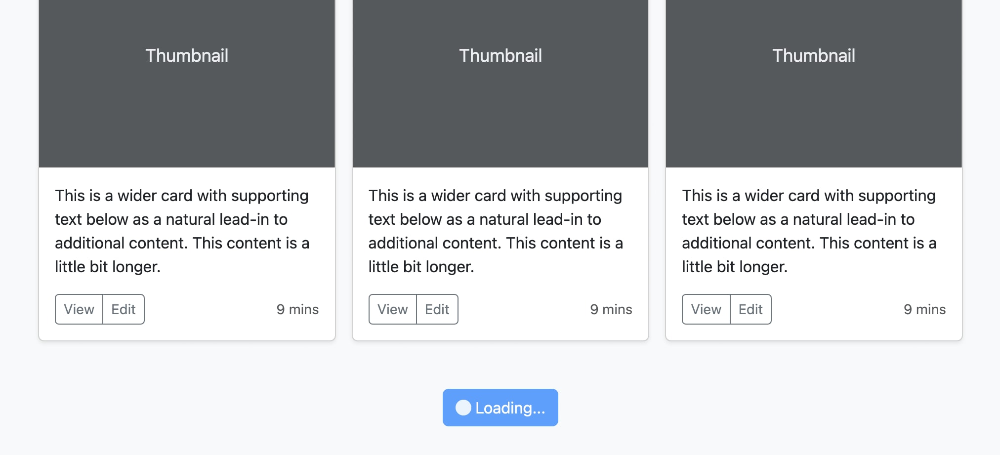

# 🦅 Loadable objects for Silverstripe

[](https://packagist.org/packages/goldfinch/loadable)
[](https://packagist.org/packages/goldfinch/loadable)
[](https://packagist.org/packages/goldfinch/loadable)
[](https://packagist.org/packages/goldfinch/loadable) 

**Load more** implementation ⏳ for Silverstripe with front-end component 🌀. Easy to use and customize.



## Available Taz commands

If you haven't used [**Taz**](https://github.com/goldfinch/taz)🌪️ before, *taz* file must be presented in your root project folder `cp vendor/goldfinch/taz/taz taz`

---

> Extend model making it loadable
```bash
php taz loadable
```

## Install

#### 1. Install module
```bash
composer require goldfinch/loadable
```

#### 2. Add key to your **.env**

Use [**Taz**](https://github.com/goldfinch/taz)🌪️ to generate and add the key.

```bash
php taz generate:app-key
```

#### 3. Generate config file

Use [**Taz**](https://github.com/goldfinch/taz)🌪️ to generate the config. It will quickly lead you through the setup and take care of it for you.

```bash
php taz loadable
```

#### 4. Make sure these meta tags are presented in your header

```html
<meta name="csrf-param" content="authenticity_token">
<meta name="csrf-token" content="{$SecurityID}">
```

#### 5. Implement JavaScript front-end component

*via Silverstripe Requirements PHP*

```php
Requirements::javascript('goldfinch/loadable:client/dist/loadable.js');
```

*via template require*

```html
<% require javascript('goldfinch/loadable:client/dist/loadable.js') %>
```

*via ES6 module*

```js
import Loadable from '..../vendor/goldfinch/loadable/client/src/src/loadable-mod';

document.addEventListener('DOMContentLoaded', () => {
  new Loadable();
});
```

#### 6. Create a loadable template

All loadable templates are stored within a single folder `templates/Loadable`. The name should be the same as your targeted model's name.

*Example:*

Loadable template for `app/Models/MyLoadableModel.php`
would be `themes/my_theme/templates/Loadable/MyLoadableModel.ss`

(❗) The content in each template must start with a tag that has `data-loadable-list-item` attribute which represents a single loadable item

```html
<div data-loadable-list-item>
  <!-- my custom code goes here -->
</div>
```

*Real-case example:*

```html
<a href="{$Link}" data-loadable-list-item>
  $Image
  <h3>$Title</h3>
</a>
```

## Usage

To call the loadable area use one of the examples below for further customization

#### Method 1 (quick preview for test)

```html
$Loadable(App\Models\MyLoadableModel)
```

#### Method 2 (basic)

```html
<% with $LoadableWith(App\Models\MyLoadableModel) %>
  <div data-loadable-area>
    $List
    <div>
      $Action
    </div>
  </div>
<% end_with %>
```

#### Method 3 (fully customizable)

```html
<% with $LoadableWith(App\Models\MyLoadableModel) %>
  <div data-loadable-area>
    <% with Data %>
    <div data-loadable-list data-loadable-remains="$CountRemains">
      <% loop List %>
        $loadableTemplate
      <% end_loop %>
    </div>
    <div>
      <button
        data-loadable-action
        data-loadable-params='{"search": "some search value"}'
        data-loadable-stock="{$LoadableObject}"
        data-loadable-substance="{$LoadableMethod}"
        data-loadable-substance-id="{$LoadableMethodID}"
        data-loadable-scroll-offset="100"
        data-loading="false"
        class="btn btn-primary"
        type="button"
      >
        <span class="d-none spinner-border spinner-border-sm" aria-hidden="true"></span>
        <span role="status">Load more<span data-loadable-remaning></span></span>
      </button>
    </div>
    <% end_with %>
  </div>
<% end_with %>
```

#### Method 4 (bridge - list through class method)

To use this method, we need to do a few more settings:

1) Call loadable instance passing $ID and $Method

```html
$Loadable(App\Models\ProjectCategory, $ProjectCategoryID, Projects)
$LoadableWith(App\Models\ProjectCategory, $ProjectCategoryID, Projects)
```
* `Projects` in this example is a method in `ProjectCategory` model that returns `DataList`. It could be basic custom method or `has_many`/`many_many`/`belongs_many_many`

```php
class ProjectCategory {
    
    // as relationship
    private static $belongs_many_many = [
        'Projects' => ProjectItem::class,
    ];

    // or as custom method
    public function Projects()
    {
        // return $this->Projects();
        return ProjectItem::get();
    }
}
```


2) Add `bridge` to our config:
```yml
Goldfinch\Loadable\Loadable:
  loadable:
    App\Models\ProjectItem:
      initial_loaded: 10
      per_each_load: 10
      bridge:
        App\Models\ProjectCategory: Projects
```

## Other options

Properties like `initial_loaded`, `per_each_load` can be declared in database instead. Using [SomeConfig](https://github.com/jonom/silverstripe-someconfig). If you use [**Taz**](https://github.com/goldfinch/taz)🌪️ command `php taz loadable`, it will handle this setup for you anyway, but for your reference:

1) We need to specify `dbconfig` in our config as shown in the example below

```yml
Goldfinch\Loadable\Loadable:
  loadable:
    App\Models\MyLoadableModel:
      dbconfig:
        App\Configs\MyConfig:
          initial_loaded: InitialLoaded
          per_each_load: PerEachLoad
```

2) Based on the example above, our *MyConfig* class would look like this:

```php
use JonoM\SomeConfig\SomeConfig;
use SilverStripe\ORM\DataObject;
use SilverStripe\View\TemplateGlobalProvider;

class MyConfig extends DataObject implements TemplateGlobalProvider
{
    use SomeConfig;

    private static $db = [
        'InitialLoaded' => 'Int(10)',
        'PerEachLoad' => 'Int(10)',
    ];
}
```

## Sidenotes

*manually extended model*

If you don't want to use `LoadableExtension` extension, you can prepare your loadable model 

```php
use SilverStripe\ORM\DataList;
use SilverStripe\Control\HTTPRequest;

public static function loadable(DataList $list, HTTPRequest $request, $data, $config): DataList
{
    // apply some additional filtering to the list as needed

    return $list;
}

public function loadableTemplate()
{
    return $this->renderWith('Loadable/MyLoadableModel');
}
```

## Events

Available JavaScript callback events

```js
window.goldfinch.loadmore_before_callback = (action) => {
  console.log('loadmore before', action)

  let list = action.closest('[data-loadable-area]').children('[data-loadable-list]')

  // ..
}

window.goldfinch.loadmore_after_callback = (action) => {
  console.log('loadmore after', action)

  let list = action.closest('[data-loadable-area]').children('[data-loadable-list]')
  
  // ..
}
```

## License

The MIT License (MIT)
